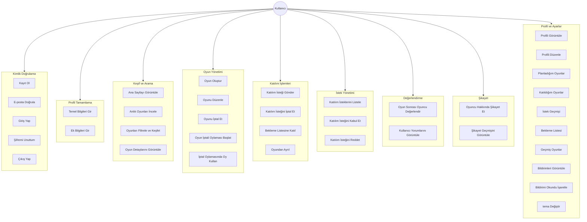
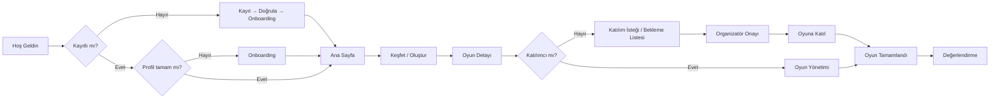

# Match Play - Kullanım Senaryosu Diyagramı

Bu doküman, Match Play uygulamasındaki kullanıcı rolleri ve özelliklerin kullanım senaryolarını açıklar.

---

## 1. Aktörler (Kullanıcı Rolleri)

Match Play'de tek bir **Kullanıcı** aktörü vardır. Aynı kullanıcı farklı durumlarda farklı roller üstlenebilir:

| Rol | Açıklama |
|-----|----------|
| **Organizatör (Oyun Kuran)** | Oyun ilanı oluşturan, katılım isteklerini yöneten kullanıcı |
| **Katılımcı (Oyun Arayan)** | Oyun arayan, katılım isteği gönderen veya bekleme listesine giren kullanıcı |
| **Oyuncu** | Oyuna kabul edilmiş, oyunu oynayan veya oynamış kullanıcı |

---

## 2. Kullanım Senaryosu Diyagramı (Mermaid)

---

## 3. Senaryo Detayları

### 3.1. Kimlik Doğrulama

| Senaryo | Açıklama | Ekran |
|---------|----------|-------|
| **Kayıt Ol** | .edu uzantılı e-posta ile kayıt başlatır. OTP kodu gönderilir. | `/auth/register` |
| **E-posta Doğrula** | Gelen OTP kodunu girerek e-postayı doğrular. | `/auth/verify-email` |
| **Giriş Yap** | E-posta ve şifre ile sisteme giriş yapar. | `/auth/login` |
| **Şifremi Unuttum** | Yeni şifre belirlemek için e-posta doğrulama başlatır. | `/auth/forgot-password` |
| **Çıkış Yap** | Oturumu sonlandırır. | Ayarlar ekranı |

---

### 3.2. Profil Tamamlama (Onboarding)

| Senaryo | Açıklama | Ekran |
|---------|----------|-------|
| **Temel Bilgileri Gir** | İsim, soyisim, üniversite gibi zorunlu alanları doldurur. | `/onboarding/basic-info` |
| **Ek Bilgileri Gir** | Bölüm, biyografi, ilgi alanları, yetenek seviyesi vb. ekler. | `/onboarding/additional-info` |

---

### 3.3. Keşif ve Arama

| Senaryo | Açıklama | Ekran |
|---------|----------|-------|
| **Ana Sayfayı Görüntüle** | İstatistikleri, anlık oyunları ve bugünkü oyunları görür. | `/(tabs)/home` |
| **Anlık Oyunları İncele** | 2 saat içinde başlayacak, yer olan oyunları listeler. | Ana sayfa |
| **Oyunlarımı Filtrele ve Keşfet** | Oyun tipi, konum, tarih, cinsiyet tercihi, yetenek seviyesi, ücret vb. ile filtreleme yapar. | `/(tabs)/discover` |
| **Oyun Detaylarını Görüntüle** | Oyunun başlık, açıklama, konum, tarih, oyuncu bilgileri ve kurucu profilini inceler. | `/game/[id]` |

---

### 3.4. Oyun Yönetimi (Organizatör)

| Senaryo | Açıklama | Ekran |
|---------|----------|-------|
| **Oyun Oluştur** | Oyun tipi seçimi, başlık/açıklama, konum/zaman, oyuncu sayısı, kriterler belirleyip oyun ilanı yayınlar. | `/(tabs)/create` |
| **Oyunu Düzenle** | Taslak veya açık oyundaki bilgileri günceller. | Planladığım Oyunlar → Oyun detayı |
| **Oyunu İptal Et** | Oyuna katılanların onayına sunarak oyunu iptal edebilir. | Oyun detayı |
| **Oyun İptali Oylaması Başlat** | Tüm katılımcıların iptal oylamasına katılmasını talep eder. | Oyun detayı |
| **İptal Oylamasında Oy Kullan** | İptali onaylayan veya reddeden oy verir. | `/vote/[id]` |

---

### 3.5. Katılım İşlemleri (Katılımcı)

| Senaryo | Açıklama | Ekran |
|---------|----------|-------|
| **Katılım İsteği Gönder** | Oyuna katılmak için organizatöre istek gönderir (opsiyonel mesaj ile). | Oyun detayı |
| **Katılım İsteğini İptal Et** | Bekleyen katılım isteğini geri çeker. | Oyun detayı / İstek Geçmişi |
| **Bekleme Listesine Katıl** | Kontenjan dolu oyunlara bekleme listesine eklenir. | Oyun detayı |
| **Oyundan Ayrıl** | Katıldığı oyundan ayrılır. | Oyun detayı / Katıldığım Oyunlar |

---

### 3.6. İstek Yönetimi (Organizatör)

| Senaryo | Açıklama | Ekran |
|---------|----------|-------|
| **Katılım İsteklerini Listele** | Oyuna gelen tüm katılım isteklerini listeler. | `/game/[id]/requests` veya Planladığım Oyunlar → İstekler |
| **Katılım İsteğini Kabul Et** | Bir katılım isteğini kabul ederek oyuncuyu oyuna ekler. | İstekler ekranı |
| **Katılım İsteğini Reddet** | Bir katılım isteğini reddeder. | İstekler ekranı |

---

### 3.7. Değerlendirme

| Senaryo | Açıklama | Ekran |
|---------|----------|-------|
| **Oyun Sonrası Oyuncu Değerlendir** | Tamamlanan oyunun diğer katılımcılarına 1–5 yıldız ve opsiyonel yorum verir. | `/rating/[gameId]` |
| **Kullanıcı Yorumlarını Görüntüle** | Kendisine verilen değerlendirmeleri ve yorumları görür. | `/my/ratings` |

---

### 3.8. Şikayet

| Senaryo | Açıklama | Ekran |
|---------|----------|-------|
| **Oyuncu Hakkında Şikayet Et** | Birlikte oynadığı bir oyuncu hakkında şikayet mesajı gönderir. | `/complaint` (reportedId, gameId parametreleri ile) |
| **Şikayet Geçmişini Görüntüle** | Gönderdiği şikayetlerin durumunu inceler. | `/my/complaints` |

---

### 3.9. Profil ve Ayarlar

| Senaryo | Açıklama | Ekran |
|---------|----------|-------|
| **Profili Görüntüle** | Kendi profil bilgilerini, puanını ve ortalama değerlendirmeyi görür. | `/(tabs)/profile` |
| **Profili Düzenle** | İsim, fotoğraf, üniversite, bölüm, biyografi, ilgi alanları vb. günceller. | `/profile/edit` |
| **Planladığım Oyunlar** | Kendisinin kurduğu oyunları listeler. | `/my/games` |
| **Katıldığım Oyunlar** | Katıldığı oyunları listeler. | `/my/joined-games` |
| **İstek Geçmişi** | Gönderdiği katılım isteklerinin durumunu görür. | `/my/requests` |
| **Bekleme Listesi** | Bekleme listesinde olduğu oyunları listeler. | `/my/waitlist` |
| **Geçmiş Oyunlar** | Tamamlanan oyunları ve değerlendirme durumunu görür. | `/my/completed-games` |
| **Bildirimleri Görüntüle** | Katılım istekleri, oyun iptali, değerlendirme hatırlatmaları vb. bildirimleri inceler. | `/(tabs)/notifications` |
| **Bildirimi Okundu İşaretle** | Bildirimi okundu olarak işaretler. | Bildirimler ekranı |
| **Tema Değiştir** | Açık/koyu tema arasında geçiş yapar. | Ayarlar ekranı |

---

## 4. Senaryo Akış Özeti (Kısa)

---

## 5. Aktör–Senaryo Matrisi

| Senaryo | Organizatör | Katılımcı |
|---------|:-----------:|:---------:|
| Oyun Oluştur | ✓ | |
| Katılım İsteği Gönder | | ✓ |
| Katılım İsteğini Kabul/Reddet | ✓ | |
| Bekleme Listesine Katıl | | ✓ |
| İptal Oylaması Başlat | ✓ | |
| İptal Oylamasında Oy Kullan | ✓ | ✓ |
| Oyuncu Değerlendir | ✓ | ✓ |
| Şikayet Et | ✓ | ✓ |

---

*Bu doküman Match Play v1.0 uygulamasının güncel özellikleri temel alınarak hazırlanmıştır.*
