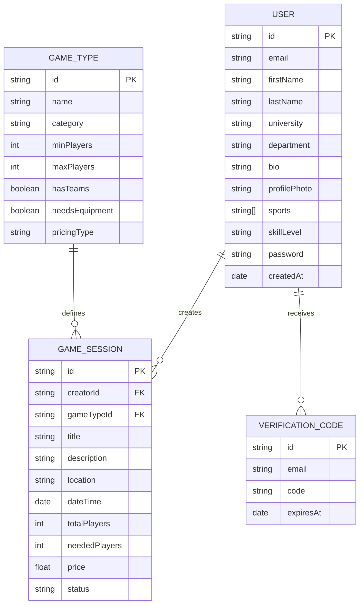
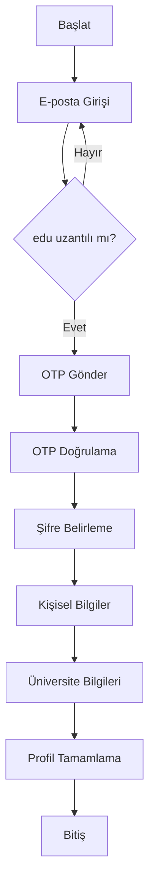
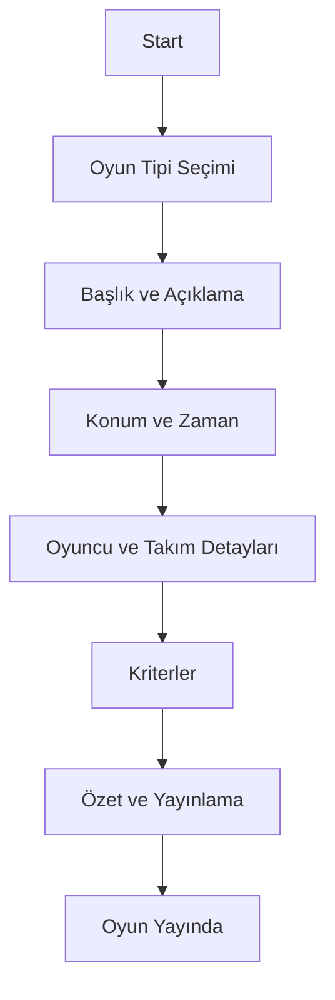

# MatchPlay Proje Final Raporu Taslağı

## 1. Giriş

### 1.1. Projenin Önemi ve Gerçekleştirilme Motivasyonu
Üniversite hayatı, sadece akademik eğitimden ibaret olmayıp, sosyal etkileşim ve fiziksel aktivitelerin de merkezi bir parçasıdır. Ancak günümüzde öğrenciler, ders yoğunlukları, kampüslerin büyüklüğü ve sosyal çevrelerinin kısıtlı olması nedeniyle ilgi duydukları spor (basketbol, voleybol, tenis vb.) veya masa/kutu oyunları için eş zamanlı olarak katılım sağlayacak partnerler bulmakta zorlanmaktadır. WhatsApp grupları veya genel sosyal medya platformları, bu tür anlık ve konum bazlı organizasyonlar için yeterince optimize edilmemiştir ve mesaj kirliliği arasında organizasyonlar kaybolmaktadır.

MatchPlay, bu problemi çözmek amacıyla; üniversite öğrencilerinin konum ve zaman bazlı olarak oyun kurmalarını, mevcut oyunlara katılmalarını ve güvenilir bir topluluk içinde yeni oyun arkadaşları edinmelerini sağlamak vizyonuyla geliştirilmiştir. Projenin ana motivasyonu, kampüs içi sosyal etkileşimi artırmak ve öğrencilerin boş vakitlerini daha aktif ve verimli değerlendirmelerine olanak tanımaktır.

### 1.2. Literatür Taraması
Piyasada benzer amaçlara hizmet eden Playo, Meetup ve TeamReach gibi uygulamalar bulunmaktadır:
*   **Playo:** Daha çok spor tesisleri rezervasyonu ve profesyonel/yarı profesyonel oyuncu eşleşmelerine odaklanmaktadır.
*   **Meetup:** Genel etkinlik odaklıdır ve kampüs yaşamına özel, anlık "hadi maç yapalım" dinamiklerini karşılamada hantaldır.
*   **TeamReach:** Takım yönetimi üzerine uzmanlaşmıştır ancak yeni insanlarla tanışma keşif özellikleri sınırlıdır.

### 1.3. Projenin Farklılaşan ve Öne Çıkan Yönleri
MatchPlay, rakiplerinden şu temel özelliklerle ayrılmaktadır:
1.  **Güvenli Kampüs Ortamı:** Sadece `.edu` uzantılı e-posta adresleriyle kayıt kabul ederek, topluluğun sadece üniversite öğrencilerinden oluşmasını garanti eder.
2.  **Dinamik Oyun Mantığı:** Sistem, seçilen oyun tipine (örneğin Satranç ile Halı Saha maçı) göre kullanıcıdan farklı bilgiler talep eder (takım sistemi, ekipman ihtiyacı vb.) ve arayüzü buna göre şekillendirir.
3.  **Anlık Keşif (Instant Discovery):** Kullanıcının konumuna en yakın ve başlamasına en az süre kalmış oyunları ön plana çıkararak spontane katılımı teşvik eder.

---

## 2. Uygulama

### 2.1. Proje Tasarımı

#### 2.1.1. Veri Tabanı ER Diyagramı (Mantıksal Şema)
MatchPlay, ilişkisel verileri esnek bir şekilde tutabilmek için NoSQL tabanlı MongoDB kullanmaktadır. Temel veri modelleri ve ilişkileri şu şekildedir:

*   **User (Kullanıcı):** E-posta (.edu), Ad-Soyad, Üniversite, Bölüm, Biyografi, Profil Fotoğrafı, Yetenek Seviyeleri.
*   **GameType (Oyun Tipi):** Oyunun adı, kategorisi (Spor, Masa, Kart), min/max oyuncu sayısı, takım sistemi gereksinimi, ekipman durumu.
*   **GameSession (Oyun Oturumu):** Kurucu kullanıcı, oyun tipi referansı, konum (şehir/ilçe/mekan), tarih/saat, ücret bilgisi, mevcut/ihtiyaç duyulan oyuncu sayısı, açıklama.
*   **VerificationCode (Doğrulama):** E-posta doğrulama için süreli OTP kodları.

*(Raporun Word versiyonuna bu noktada bir ER diyagramı görseli eklenecektir.)*

#### 2.1.2. Kullanım Senaryosu Diyagramı (Use Case)
Sistemde iki temel kullanıcı rolü (genellikle aynı kullanıcı her iki rolü de üstlenebilir) bulunmaktadır:
1.  **Organizatör (Oyun Kuran):** Oyun tipi seçer, detayları belirler, konum ve zaman girer, ilan yayınlar ve başvuruları yönetir.
2.  **Katılımcı (Oyun Arayan):** Filtreleme yapar, harita/liste üzerinden oyunları inceler, katılma isteği gönderir ve onay durumunu takip eder.

#### 2.1.3. Akış Diyagramı (Flowchart)
*   **Kayıt Akışı:**

*   **Oyun Oluşturma Akışı:**

### 2.2. Kullanılan Teknolojiler, Altyapılar ve Kütüphaneler

#### 2.2.1. Yazılım Yığını (Tech Stack)
*   **Frontend:** React Native ve Expo Framework kullanılarak cross-platform (Android/iOS) geliştirme yapılmıştır. TypeScript ile tip güvenliği sağlanmıştır.
*   **Backend:** Node.js ve Express.js framework'ü ile RESTful API mimarisi kurulmuştur.
*   **Veritabanı:** MongoDB (Atlas Cloud) tercih edilmiş, ODM olarak Mongoose kütüphanesi kullanılmıştır.

#### 2.2.2. Temel Kütüphaneler ve Kullanım Amaçları
*   **JWT (JSON Web Token):** Kullanıcı oturum yönetimi ve yetkilendirme işlemleri için kullanılmıştır. Stateler arası güvenli geçiş sağlar.
*   **Bcrypt.js:** Kullanıcı şifrelerinin veritabanında düz metin olarak değil, geri döndürülemez hash'ler olarak saklanması için (Güvenlik Standardı) kullanılmıştır.
*   **Nodemailer:** `.edu` e-posta adreslerine doğrulama kodları göndererek güvenli kayıt akışını otomatize etmek için kullanılmıştır.
*   **Swagger (OpenAPI):** Backend API uç noktalarının (endpoints) dökümantasyonu ve test edilebilirliği için entegre edilmiştir.
*   **AsyncStorage:** Mobil tarafta kullanıcı token'larını ve oyun taslaklarını (offline persistence) saklamak için kullanılmıştır.

### 2.3. Uluslararası Standartlar ve Kısıtlar

#### 2.3.1. Uluslararası Standartlar
*   **ISO/IEC 25010 (Yazılım Kalite Modeli):** Proje, bu standartta tanımlanan "Kullanılabilirlik", "Güvenilirlik" ve "Performans Verimliliği" özelliklerine uygun geliştirilmiştir. Örneğin, 6 adımlı kayıt ve oyun oluşturma akışları, karmaşık işlemleri küçük parçalara bölerek kullanıcının hata yapma olasılığını azaltmış ve öğrenilebilirliği artırmıştır.
*   **ISO/IEC 27001 (Bilgi Güvenliği):** Tam uyumluluk sertifikası hedeflenmese de, sistem tasarımında bu standarttaki temel prensipler (Gizlilik, Bütünlük, Erişilebilirlik) uygulanmıştır. Kullanıcı şifreleri Bcrypt ile tuzlanarak (salting) hash'lenmiş, API erişimleri JWT ile sınırlandırılmış ve hassas verilerin loglarda açık metin olarak görünmesi engellenmiştir.

#### 2.3.2. Kısıtlar ve İterasyonlar (Constraints and Iterations)
*   **Mimaride Radikal İterasyon (Supabase'den Node.js'e Geçiş):** Projenin ilk fazında Supabase kullanımı tercih edilmişti. Ancak projenin ilerleyen safhalarında, oyun tiplerine göre değişen dinamik form yapıları ve daha kompleks veritabanı ilişkileri (GameType - GameSession ilişkisi) ihtiyacı doğduğunda, hazır backend çözümlerinin esnekliği yetersiz kalmıştır. Bu kısıt, projenin tamamen özel bir Node.js/Express backend yapısına taşınmasıyla aşılmıştır.
*   **Bellek ve Donanım Kısıtları:** Mobil uygulamanın düşük donanımlı cihazlarda da akıcı çalışabilmesi için React Native'in `FlatList` gibi bellek dostu bileşenleri kullanılmıştır. Ayrıca, oyun tipleri gibi sık değişmeyen veriler AsyncStorage üzerinde önbelleğe alınarak (caching) ağ trafiği ve cihazın enerji tüketimi minimize edilmiştir.
*   **Ağ Kısıtları:** Kullanıcıların kampüs içinde zayıf internet bağlantısına sahip olabileceği öngörülerek, oyun oluşturma adımları yerel depolamada taslak olarak kaydedilmekte, sadece son adımda sunucuya gönderilmektedir.

---

## 3. Sonuç

### 3.1. Proje Değerlendirmesi
MatchPlay projesi, başlangıçta hedeflenen temel özelliklerin (Kullanıcı yönetimi, Dinamik Oyun Oluşturma, Filtreleme ve Listeleme) tamamını başarıyla yerine getirmiştir. Proje, mock-data (sahte veri) aşamasından tamamen gerçek bir API ve veritabanı entegrasyonuna geçirilerek üretim ortamına hazır hale getirilmiştir.

### 3.2. İlerleme ve Gelecek Planlar
*   **Kaydedilen İlerleme:** %85 oranında tamamlanmıştır. Kayıt, profil yönetimi, dinamik oyun oluşturma, keşfetme ekranları ve istatistikler çalışır durumdadır.
*   **Gelecek Dönem Planları:**
    *   Katılımcılar için oyun içi sohbet (Lobi) sistemi.
    *   Bekleme listesi (Waitlist) algoritmasının aktifleştirilmesi.
    *   Oyun sonrası kullanıcı puanlama ve sportmenlik değerlendirme sistemi.
    *   Harita tabanlı oyun arama özelliği.

### 3.3. İş-Zaman Çizelgesi, Sapmalar ve Güncel Durum
Proje başlangıcında belirlenen iş-zaman çizelgesiyle (Gantt Chart), gerçekleşen süreçler karşılaştırıldığında genel hedeflerin %90 oranında tutturulduğu görülmektedir.

*   **Sapmalar ve Gecikmeler:** Projenin 4. haftasında planlanan "Backend Entegrasyonu" aşamasında, Supabase altyapısının projenin karmaşık iş kurallarını (işletme mantığı) tam olarak desteklemediği fark edilmiştir. Bu durum, backend mimarisinin tamamen değiştirilmesine karar verilmesine ve yaklaşık 10 günlük bir takvim sapmasına yol açmıştır.
*   **Çözüm ve Telafi:** Gecikmeyi telafi etmek amacıyla, frontend geliştirme süreciyle paralel olarak backend API'leri hızlı bir şekilde (Swagger dökümantasyonuyla birlikte) geliştirilmiştir. "Mock-data" kullanımı sayesinde frontend ekibi (veya süreci), backend hazır olana kadar arayüz geliştirmelerine kesintisiz devam edebilmiştir.
*   **Güncel İş-Zaman Çizelgesi Değişiklikleri:**
    *   **Eklendi:** "Özel API ve DB Kurulumu" adımı, daha sağlam bir altyapı için çizelgeye dahil edilmiştir.
    *   **Çıkarıldı/Ertelendi:** "Sosyal Medya Paylaşım Entegrasyonu" gibi ikincil özellikler, temel fonksiyonların (MVP) kararlılığını sağlamak amacıyla bir sonraki döneme ertelenmiştir.
    *   **Revize Edildi:** "Test Süreci", her sprint sonunda (iteratif olarak) yapılacak şekilde güncellenerek kalite kontrol süreci tüm takvime yayılmıştır.

